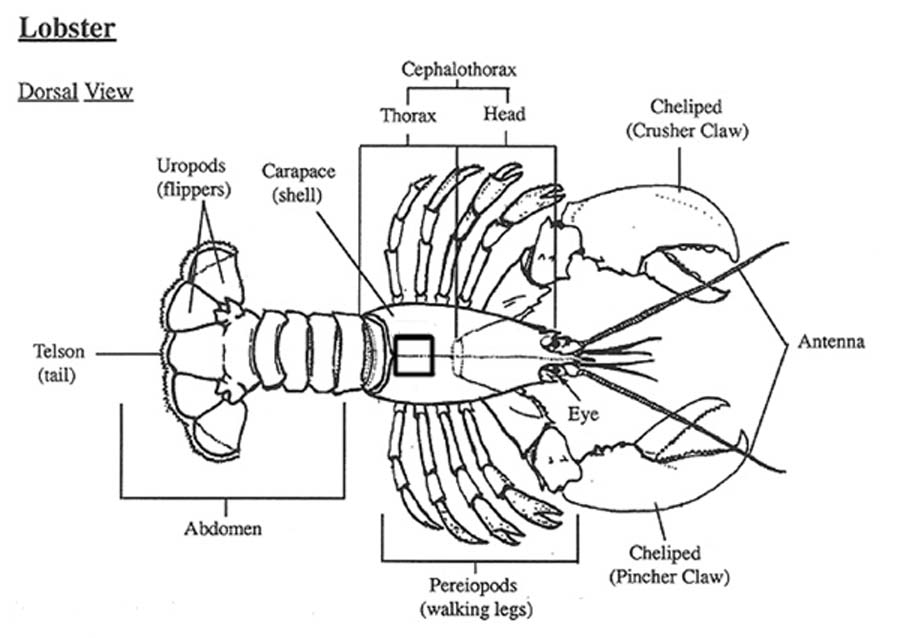
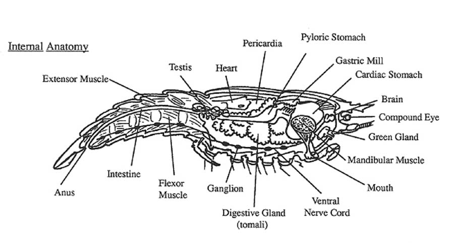

# Before Lab

This will be our invertebrate lab. We will be studying the control of the neurogenic heart of crustaceans using the lobster as a model.

:::{.callout-note}
# Prepare for lab by:
- Read the lab manual for this weekʻs experiment \[[Lab 6](Lab6-lobster-heart.pdf)\] exploring the physiology of the toad heart using ECG and a force transducer.  
- Write the \[[Prelab](../../labs-misc/lab-notebook.qmd#sec-prelab)\] in your lab notebook. 
  + For the __Intro__, focus on identifying the physiological mechanisms (outline them), and end with a paragraph of hypotheses/expectations (like the worksheet).
  + Think about __strong hypotheses__! _Strong hypotheses lead to excellent reports._
  + __Methods__: subjects, experimental methods and analyses (how you will compare to address the hypotheses -- _you should start thinking about how you will plot the data for the results to make these answers pop_). 
- Do prelab Quiz on Lamaku (open 24 hrs before lab). 
- Please check out the \[[powerpoint notes](../../powerpoints/Lab6.HeartControlLobster.pdf)\] and the review paper on the \[[crustacean cardiac ganglion](Cooke02.pdf)\] by our very own Dr. Ian Cooke who was an emeritus faculty from the Zoology Department and PBRC, a pioneer in invertebrate neurophysiology!
:::

## In Lab: 

- _Plan to Work quickly!_ __You will have 30 min (and very lucky if you have an hour)__ once you open the carapace. 
- Keep your animal chilled (they are Maine lobsters!) and irrigated with ice-cold Lobster ringers at all times.
- Lab 6 manual \[[pdf](Lab6-lobster-heart.pdf)\] . Record data in your lab notebook. 
- You should have plenty of time to complete the data collection and your figures during lab.  
- This will be a Group Lab. Begin planning with your partners as you work. 
- Start an outline with your lab partners and start outlining your discussion points, and the rest of the report. Use your time wisely to brainstorm as you work.   
- Lobster external anatomy \[[jpg](lobster-dorsal-view.jpg)\]
- Lobster internal anatomy \[[jpg](lobster-internal-anatomy.jpg)\]

{width="6in" height="4in"}   
{width="6in" height="4in"}  

## After Lab: 

- Group lab report due next week. See the guidance at the end of the \[[Lobster Heart lab manual](Lab6-lobster-heart.pdf)\]. This week you will submit an individual worksheet (IWS), and you may also want to look over the guidance at the end of the lab manual for suggestions for your thinking.  
- Always follow the content guidelines: \[[grading guidelines](../../labs-misc/handouts/Zool430lab_report_guidelines.pdf)\]

