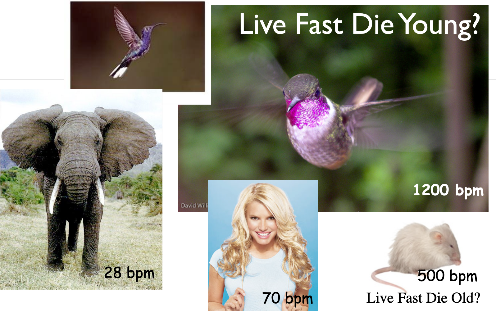
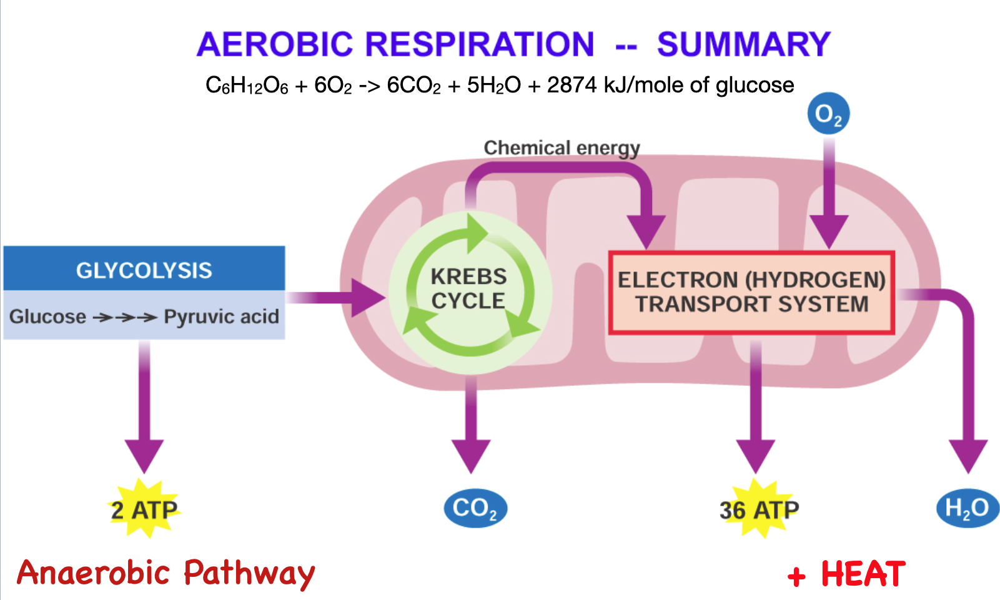
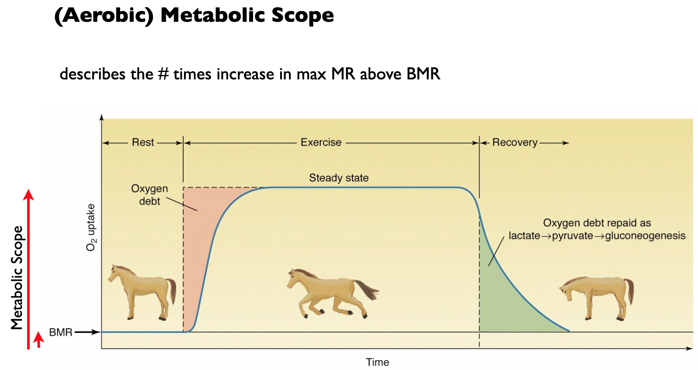
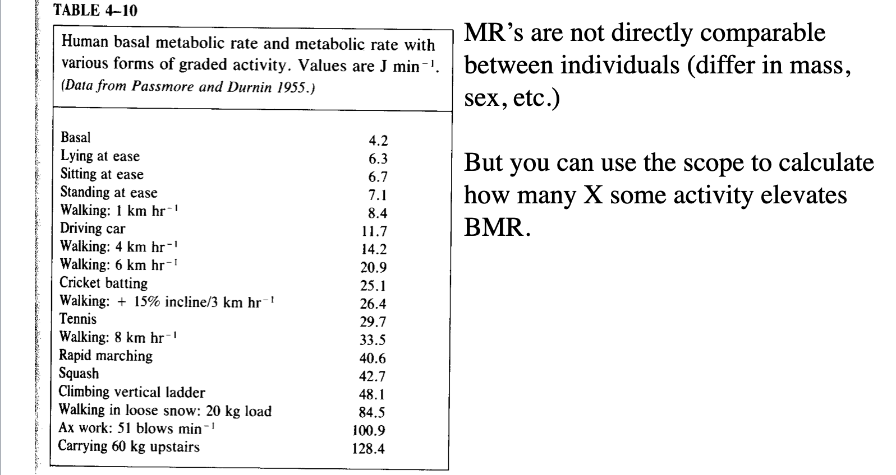
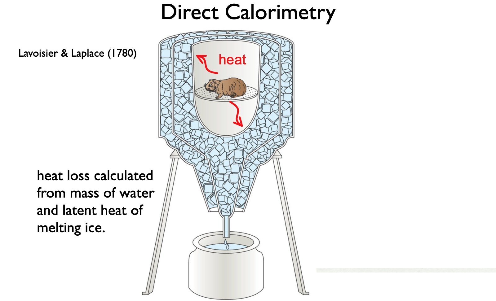
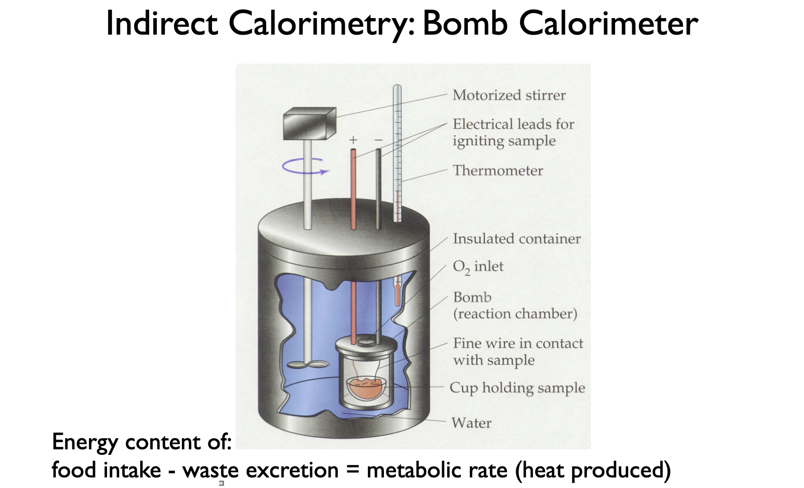
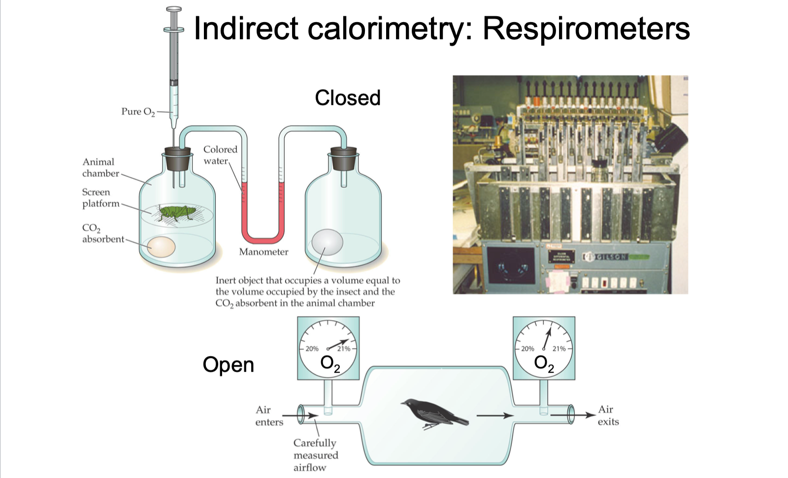

# Pre-class materials 

::: {.callout-note}
## Read ahead

**Before class, you can prepare by reading the following materials:**

1. \[[Discussion Questions and reading assignment](../../discussions/Discussion-Week2-metabolism.pdf)\] Note that there are readings from your textbook (Withers, 1992) as well as Hill Wise and Anderson (see HWA) on \[[(shared google drive)](https://drive.google.com/drive/folders/1ONGdTPdeQz2lgGgAiWyZ_yGRmmcNSwoV)\]. (These are on the shared google drive > Supplemental_Textboooks). A few of you didn't pick up your textbook rentals, please do so Tuesday! Just for you, just for this time, I put up scans of the Withers readings on the shared google drive in the same folder. 
2. Optional - take a peek at the \[[Slide Deck](../../powerpoints/2.Metabolism.pdf)\]
3. Add your fossil [here](https://docs.google.com/spreadsheets/d/1ltSJWU8k0LD_U0ZnFzrzyZ_fQGIj6aJ1Sxnmrx0a4Ek/edit?gid=0#gid=0) 
4. You might want to get a manila folder to put all your class handouts in :).  
:::

### Announcements/Reminders

- Looking ahead: Due next Wednesday 9/10, [HW1](../../homework/HW1metabolism.pdf) 
- Due Monday [Background Bullet Points](../../projects/0.BackgroundBulletPoints.qmd) (first pass, you can revise).
- You should have your book. Rent from us ($20) at EDM 101. 
- Please turn in your Library Day worksheet.
- Please friend me on Discord/ __Always tag your partners on anything group-related__
- Labs this Week - [Human ECG](../../labs/Lab4-human-ecg/Lab4.qmd). Bring:
  - Complete your [prelab](../../labs/Lab-notebooks/lab-notebook.qmd) in your lab notebook
  - Do your prelab quiz on Lamaku before you come to lab
  - One hardcopy of Lab 1 to turn in.
 
## Introducing Design 1 

Please sit with your design partners for this part. Let's discuss a roadmap for the next month. 

- Look forward: [Design 1](../../projects/design1.qmd) 
- Is built from [Background Bullet Points](../../projects/0.BackgroundBulletPoints.qmd)
- [Homeworks 1](../../homework/HW1metabolism.pdf) and 2 teach you how to do the analysis, from the assumptions you make based on your literature research. 
- This week's discussions prepare you for doing the homework. For HW1, you can do as a group with your Week 2 discussion group. 
- Need help? Come see me with your partner/group members at office hours <https://calendly.com/mbutler808/office-hours>

### Week 2 Discussion Groups

| Group | Partner 1 | Partner 2 | Partner 3 |
|----|----|----|----|----|
| 1 | Xavier  | Trey  | Peigi |
| 2 | Paris  | Carla  | Kyra |
| 3 | Reagan  | Niki  | Manuel |
| 4 | Emma  | Dallas  |  |
| 5 | Darwin | Alice  |  |

## Successful Discussions

- [__Encourage equal participation__]{style="color: blue"}
  - [Take turns going first]{style="color: blue"}
- __Dig deeper__ into a subject
- Bring out __everyone's ideas__
- Explore and evaluate __arguments__
- Provide a forum for __pitching ideas__ and __practicing vocabulary__
- Are interactive, evaluate strengths and soft-spots

# 2a. Metabolism and how do we measure the cost of being alive?

\[[Slide Deck](../../powerpoints/2.Metabolism.pdf)\]



## Discussion Questions 

1.  What is BMR and SMR? Why do we need both? What is the difference between BMR/SMR and RMR? What is AMR and MMR?

2.  What is absolute aerobic scope and factorial aerobic scope? Is it specific to an activity? Why? What are the rough rules of thumb for how much higher RMR, AMR, and MMR are above BMR or SMR for active endotherms vs ectotherms? (Look in Withers). If you knew an animal’s RMR and the types of activity it did, what strategy could you use to estimate DMR (Daily Metabolic Rate)?

3. We know that MR varies by animal size and taxonomic group. If we knew the cost of running in a 70kg human (letʻs say approximately 10x BMR), how can we use this information to estimate the cost of the same activity in a different animal?  What is the justification?

4. What is direct and indirect calorimetry? Why can we metabolism by measuring an animal's heat production (think thermodynamics)?  When we try to measure metabolism by measuring heat, or O2, or CO2 -- which methods are good for aerobic vs. anaerobic metabolism?

# For Next Class 2b. Size and Scaling 
::: {.callout-note}
## Read ahead

**Before class, you can prepare by reading the following materials:**
1. \[[Continuing the Discussion Questions](../../discussions/Discussion-Week2-metabolism.pdf)\] Jump to Q6  
2. Watch the Scaling Podcast

:::

::: callout-note
## Reminders and materials
1. Background Bullet Points due Friday 
2. \[[Scaling Example](../../discussions/2.ScalingExample.pdf)\] 
3. \[[Slide Deck](../../powerpoints/2.Scaling.pdf)\] 
4. After Fridays's class, please fill out _Discussion Evaluations_ - look for email from __TEAMMATES__
:::

## If you would like some more review (optional)

### A walk through of BMR scaling equations 


### Refresher on log_10, lines, and how much to feed your elephant



# For Next Week

- Stay tuned for the Zoo Lab
- Look ahead to the lecture post for 3. Temperature. Watch podcasts, etc. 
- \[[HW1](../../homework/HW1metabolism.pdf)\] Due Wednesday 9/10, written by hand. Submit in person. For this time only, you may work together with your discussion group if you promise to work out the problems together. Keep in mind that everyone must be able to do all of the problems. 
